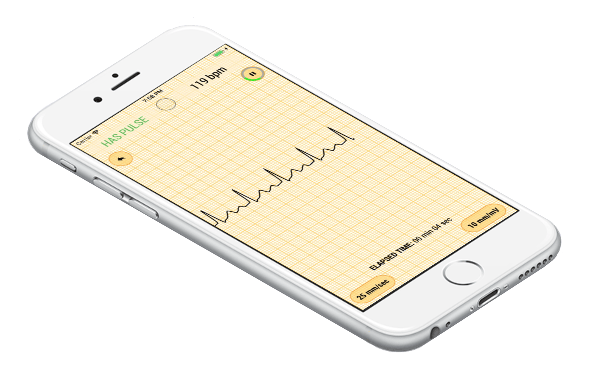

# First Aid mob



[](https://apps.apple.com/us/app/id1474445891)

## What is it about?

<div style="text-align: justify;">
The application serves to work in conjunction with a personal ECG monitor KM-1 or with devices similar in parameters. The system (device and application) are designed to monitor the cardiac activity of affected people during heart attacks, accidents, injuries, terrorist acts or on the battlefield. 
<br/><br/>
When using an ECG monitor, the actions of other people during primary resuscitation before the arrival of the doctors (“First Aid”) become much more effective. When using the device, it is not necessary to grope for the victim’s carotid artery and, very importantly, do not interrupt heart massage and artificial respiration for periodic monitoring. Practice has shown that the method of manual indication of the pulse is not reliable, especially in extreme conditions.
<br/><br/>
The cardiac activity of the victim is evaluated by an electrocardiogram (ECG), which comes from adhesive electrodes glued to the patient's wrists. This allows not to undress a person, which is very important in an extreme situation. The electrocardiogram amplifies, coded and on a cable comes to the iPhone. It is displayed on the display, and a special algorithm determines the presence or absence of a pulse.
</div>

<br/>

## Features

The application has the following main features:

* Rewinding of the last 15 seconds of recorded ECG
* Selection of ECG amplitude and speed
* Noise-resistant ECG recording
* Fast heart-rate detection
* Simple UI
* Protection from using mini-cardiograph while charging an iPhone
* Mini-cardiograph discharge detector
* User has full control over recordings (the app has no server backend or data collection routines)

## Links

* [KardioMob](https://ecgmobile.github.io)

* [First Aid mob on the App Store](https://apps.apple.com/us/app/id1474445891)

```
```
