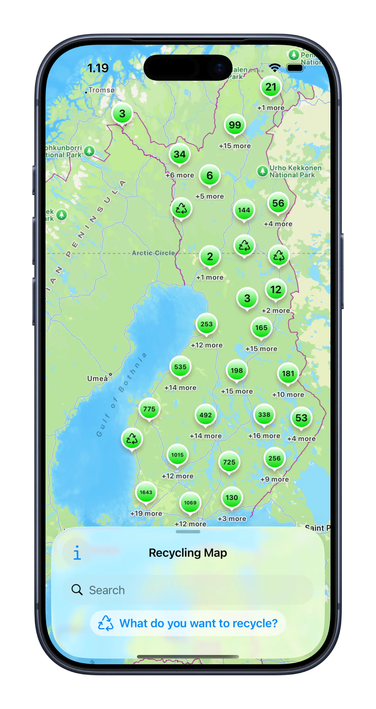
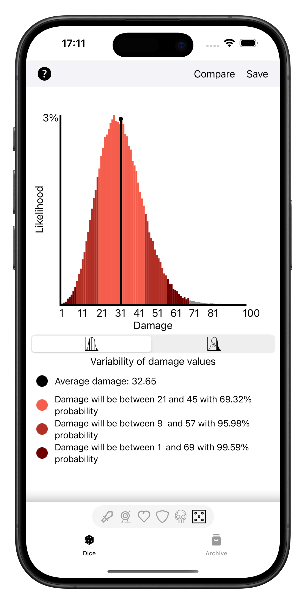
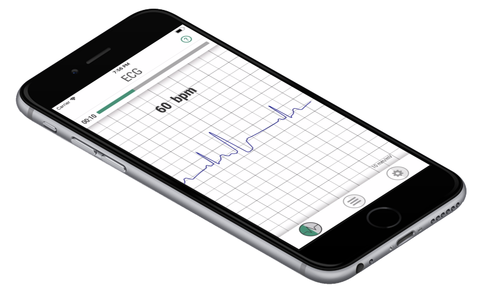
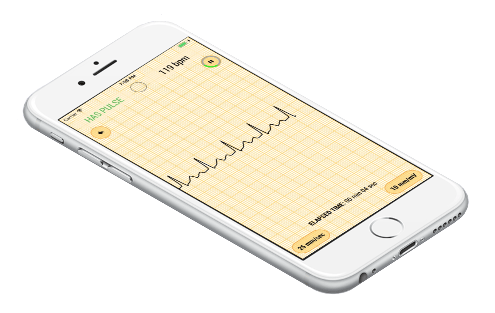

## Projects
> [Kierrätyskartta](https://kierratyskartta.github.io)
---

<div style="display:flex; align-items: center;">
    <div style="flex:1">
        
    </div>
    <div style="flex:1;padding-left:10px;">
        <h3>Find recycling and collection points across Finland</h3>
        <br/>
        <a href="https://apps.apple.com/fi/app/id6757157926">
            
        </a>
    </div>
</div>

<br/>

```
```

> [Dice Goblin](https://dicegoblinapp.github.io)
---

<div style="display:flex; align-items: center;">
    <div style="flex:1">
        
    </div>
    <div style="flex:1;padding-left:10px;">
        <h3>Complex rolls made easy!</h3>
        <br/>
        <a href="https://apps.apple.com/us/app/id1543604805">
            
        </a>
    </div>
</div>

<br/>

```
```

> [ECG mob]({{ site.baseurl }})
---



[](https://apps.apple.com/us/app/id1406511388)

```
```

> [First Aid mob]({{ site.baseurl }})
---



[](https://apps.apple.com/us/app/id1474445891)

```
```

> [OpenCL for Visual Studio Code]({{ site.baseurl }})
---


*OpenCL is the trademark of Apple Inc.*

```
```
