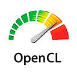

[](https://marketplace.visualstudio.com/items?itemName=galarius.vscode-opencl) [](https://marketplace.visualstudio.com/items?itemName=galarius.vscode-opencl) [](https://marketplace.visualstudio.com/items?itemName=galarius.vscode-opencl)

This extension adds [OpenCL C/C++](https://en.wikipedia.org/wiki/OpenCL) language support to [VS Code](https://code.visualstudio.com).

### Features

* OpenCL C/C++ Syntax Highlighting
* OpenCL Compute Kernel Support (`*.cl`, `*.ocl`)
* OpenCL Devices Information
* Kernel Diagnostics
* Kernel Formatting
* Offline Kernel Compilation
* Built-in OpenCL API Reference
* Auto Completion of Built-in OpenCL Symbols
* Code Snippets

### Download on

* [Visual Studio Marketplace](https://marketplace.visualstudio.com/items?itemName=galarius.vscode-opencl)

* [Open VSX Registry](https://open-vsx.org/extension/galarius/vscode-opencl)

* [GitHub Latest Release](https://github.com/Galarius/vscode-opencl/releases/latest)

```
```

*OpenCL is the trademark of Apple Inc.*