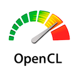

This extension adds [OpenCL C/C++](https://en.wikipedia.org/wiki/OpenCL) language support to [VS Code](https://code.visualstudio.com).

## Features

- Kernel Diagnostics ¹
- Code Completion ¹
- OpenCL Devices Information ¹
- Built-in OpenCL API Reference
- Code Snippets
- Kernel Formatting
- OpenCL C/C++ Syntax Highlighting
- OpenCL Compute Kernel Support (`*.cl`, `*.ocl`)
- Offline Kernel Compilation

> ¹ Powered by [opencl-language-server](https://github.com/Galarius/opencl-language-server).

### Download on

* [Visual Studio Marketplace](https://marketplace.visualstudio.com/items?itemName=galarius.vscode-opencl)

* [Open VSX Registry](https://open-vsx.org/extension/galarius/vscode-opencl)

* [GitHub Latest Release](https://github.com/Galarius/vscode-opencl/releases/latest)

```
```

*OpenCL is the trademark of Apple Inc.*